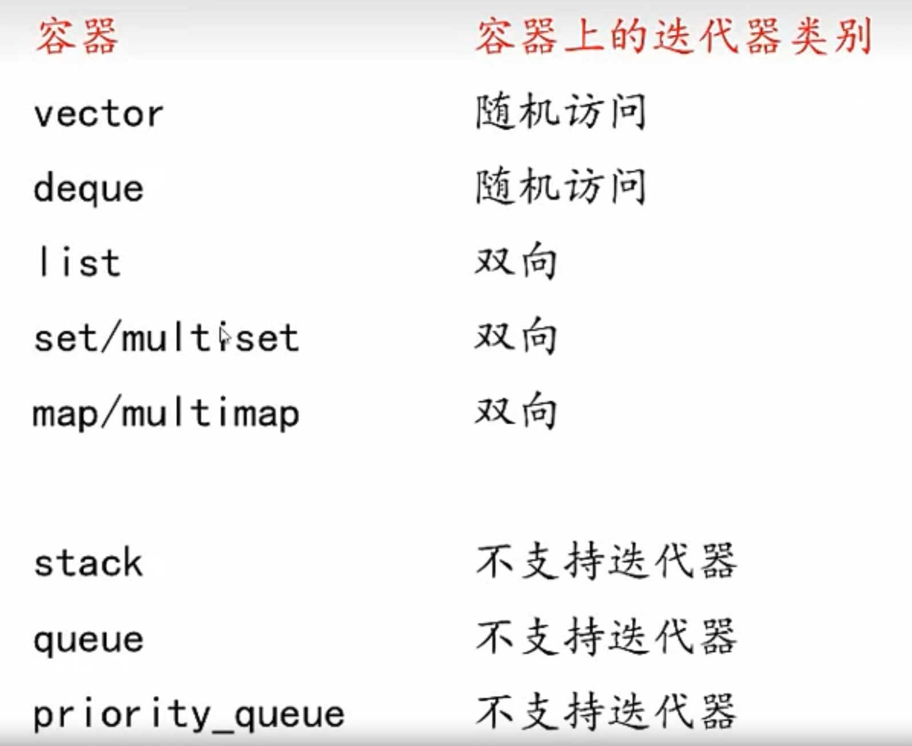

# STL 标准模板库
STL有三个基本概念
容器： 用于各种数据类型的通用数据结构，是类模板, 例如`array`, `vector`
迭代器：用于存取容器中的元素
算法：操作容器中的元素的函数模板，例如`sort()`, `find()`

## 容器
1. 顺序容器
vector, deque, list
2. 关联容器
set, multiset, map, multimap
3. 容器适配器
stack, queue, priority_queue

当对象被插入容器时，插入的对象是器复制品
### vector <vector> 
动态数组，元素在内存连续存放。在尾部插入数据效率最高
动态数组的数据结构就是预分配一个数组，在需要时进行动态扩容或缩小
### deque <deque>
双向队列，可以从头或尾部访问数据，在两端增减数据效率最高
双向队列的数据结构也是预分配一个数组，通过两个指针指向队列的头尾
deque的尾部指针可能会在头部之前，因而存取的效率会略低于vector
### list <list>
双向链表，在任意位置增删的效率都是常数时间（不含查找时间）

### 关联容器
元素都是排序的
插入任何元素都会按照排序进行
查找的效率是高
通常以平衡二叉树实现，插入和检索的时间都是O(logN)
### set/multiset <set>
set 不允许重复元素
### map/multimap <map>
map的key不能重复

### stack <stack>
### queue <queue>
### priority_queue <queue>
优先级队列

### 顺序容器和关联容器共同的成员函数
begin 返回容器第一个元素的迭代器
end   返回容器最后一个元素后面位置的迭代器
rbegin 返回最后一个元素的迭代器
rend 返回第一个元素前面位置的迭代器
erase 删除一个或多个元素
clear 删除容器中所有元素

### 顺序容器的成员函数
front 返回容器第一个元素的引用
back 返回容器最后一个元素的引用
push_back 在容器末尾增加元素
pop_back 删除容器末尾的元素
erase 删除迭代器指向的元素，或者删除一个区间，返回删除元素后面的元素的迭代器

## 迭代器
迭代器用于指向顺序容器和关联容器的元素
有const和非const
通过迭代器可以访问对应元素
迭代器操作与指针类似
`container::iterator iter1;`
`container::const_iterator citer1;`
`element = * iter1;`

